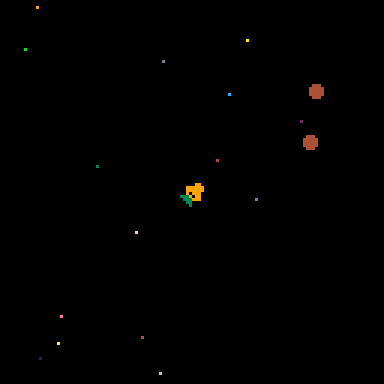
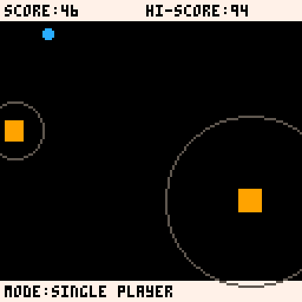
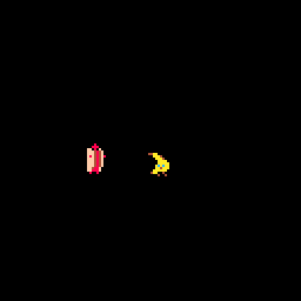

This is a repository for Pico8 games that I've made in the past. 

## What is PICO-8
[PICO-8](https://www.lexaloffle.com/pico-8.php) is a fantasy console for making, sharing and playing tiny games and other computer programs. When you turn it on, the machine greets you with a shell for typing in a subset of [Lua](https://www.lua.org/) commands and provides simple built-in tools for creating your own cartridges.

## What games are here
#### Moon Rabbit

Play as the rabbit on the moon and their carrot spaceship as they explore the galaxy in search for other celestial bodies and their respective animal inhabitants.

#### One Button

Avoid obstacles and collect powerups to get the highest score. The gimmick is that the ball moves by itself and speeds up as time progresses, and you can only temporarily stop it using _One Button_ (defaulted to 'Z').

#### Other silly animations and stuff I might use for Youtube videos

## How do I play these games

Not all games are completely done, but if they're in this repo, then they are at least playable. To play, you can download this repo and navigate into the folders above. Each of the folders has a .html file that will start the game once you click on it. Alternatively, you can also load the .P8 files directly unto a copy of the [PICO-8](https://www.lexaloffle.com/pico-8.php) fantasy console and not only see the game, but the sprite, assets, music, and code in editor mode as well.

